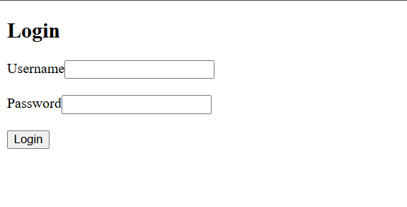
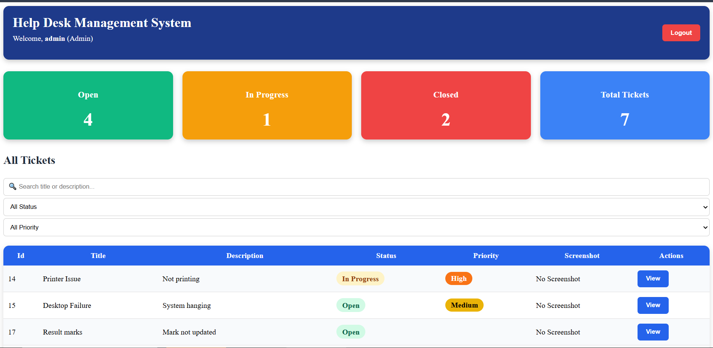
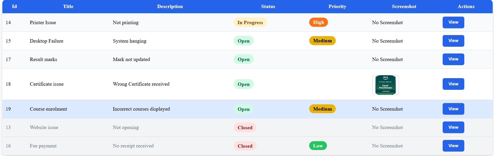
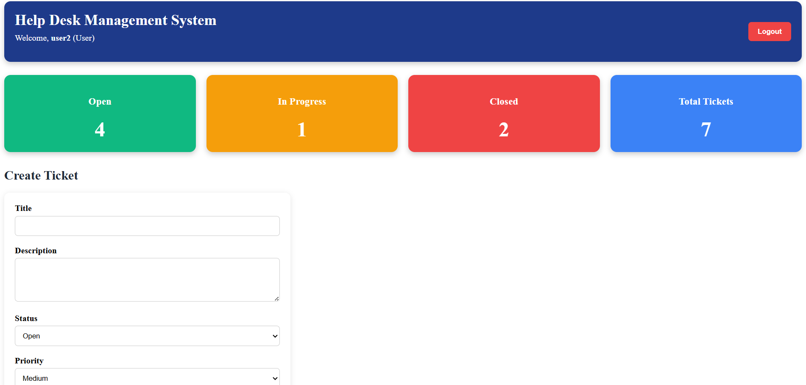
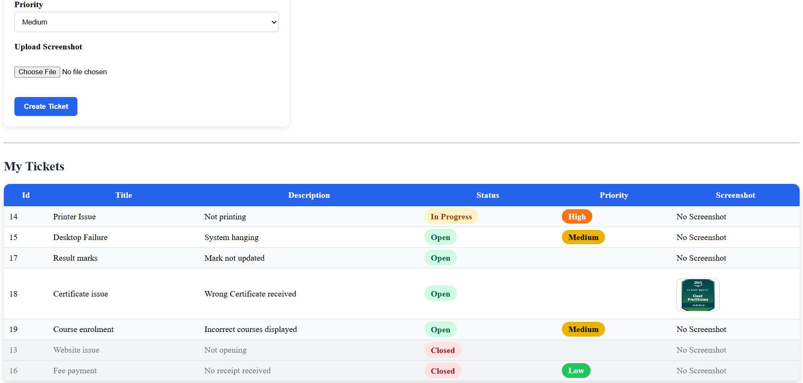
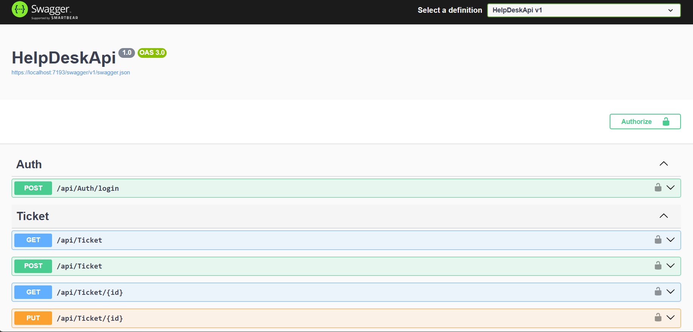
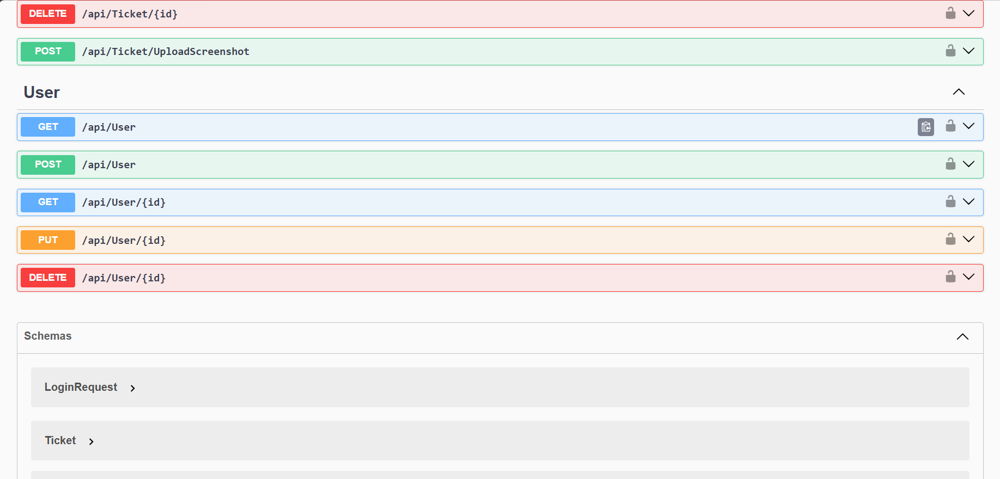

# 🎫 HelpDesk Management System

A full-stack HelpDesk Ticket Management System built using **ASP.NET Core Web API**, **Angular**, and **MySQL**. This application allows users to create support tickets while administrators can manage, update, and monitor all tickets through a secure dashboard.

---

# 🚀 Features

## Authentication
- JWT Authentication
- Secure Login
- Role-Based Authorization (Admin/User)

## Ticket Management
- Create Tickets
- View Tickets
- Update Ticket Status
- Update Ticket Priority
- Search Tickets
- Filter Tickets
- Upload Ticket Screenshots

## Admin Features
- View All Tickets
- Manage Users
- Change Ticket Status
- Update Priority

## User Features
- Login
- Create Tickets
- View Submitted Tickets
- Upload Screenshots

---

# 🛠 Tech Stack

## Frontend
- Angular
- TypeScript
- HTML5
- CSS3

## Backend
- ASP.NET Core 8 Web API
- Entity Framework Core
- Repository Pattern
- Service Layer

## Database
- MySQL

## Authentication
- JWT Token Authentication

## Version Control
- Git
- GitHub

---

# 📂 Project Structure

```
HelpDesk-Management-System
│
├── HelpDeskApi
│   ├── Controllers
│   ├── Models
│   ├── Repositories
│   ├── Services
│   ├── Data
│   └── Migrations
│
└── helpdesk-ui
    ├── pages
    ├── services
    ├── models
    ├── interceptors
    └── components
```

---

# ✨ Implemented Functionalities

✔ User Registration

✔ User Login

✔ JWT Authentication

✔ Role-Based Authorization

✔ CRUD Operations

✔ Ticket Status Update

✔ Ticket Priority Update

✔ Search & Filter Tickets

✔ Image Upload

✔ Dashboard

✔ Repository Pattern

✔ Service Layer Architecture

✔ Entity Framework Core

✔ Swagger API Documentation

---

# 📸 Screenshots

## Login Page




---

## Dashboard



---

## Ticket Management



---

## Ticket Details


---

## User Management




---

## Swagger API




---

# ⚙️ How to Run

## Backend

```bash
cd HelpDeskApi
dotnet restore
dotnet run
```

Backend runs on:

```
https://localhost:7193
```

---

## Frontend

```bash
cd helpdesk-ui
npm install
ng serve
```

Frontend runs on:

```
http://localhost:4200
```

---

# 📚 Future Enhancements

- Email Notifications
- Ticket Assignment
- Ticket Comments
- Dashboard Analytics
- Pagination
- Dark Mode
- Audit Logs

---

# 👨‍💻 Author

**Tharun Arun**

GitHub:
https://github.com/tharunarun7

---

⭐ If you like this project, consider giving it a star!